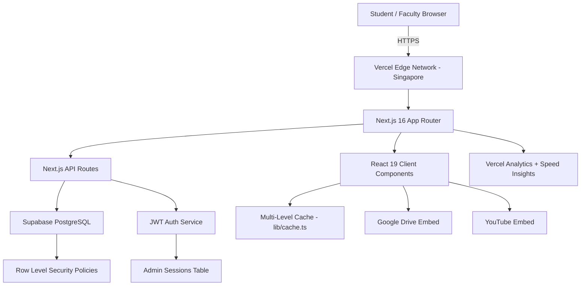
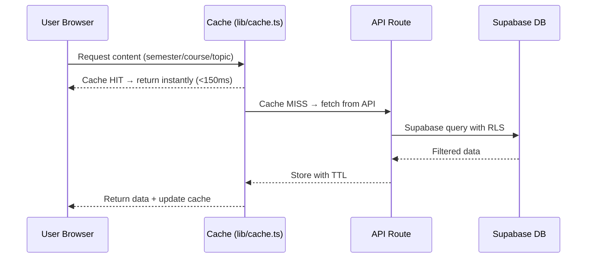
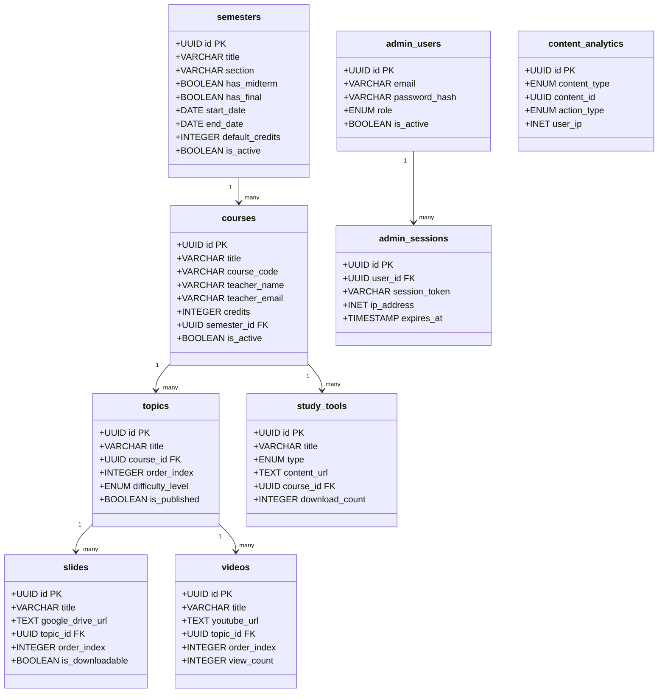
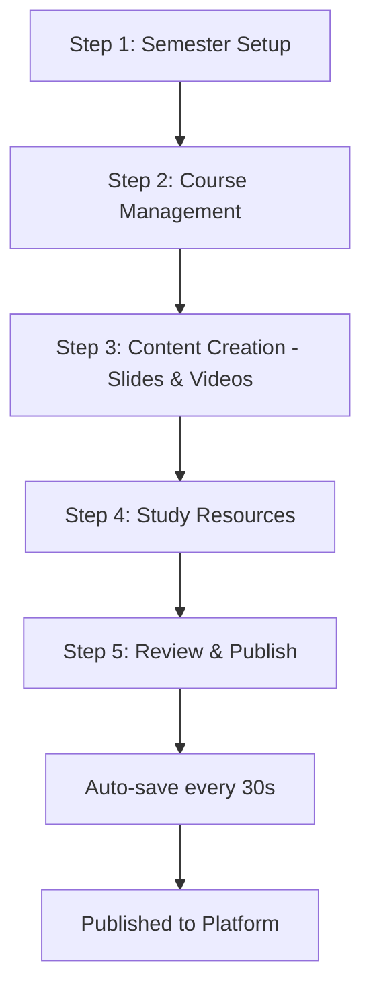
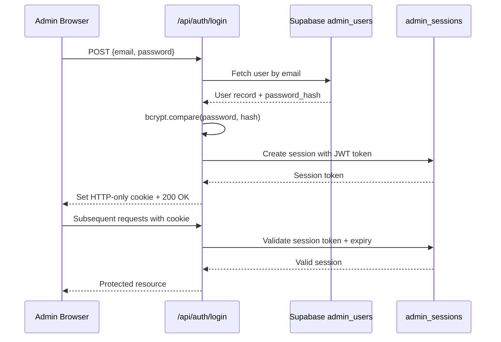
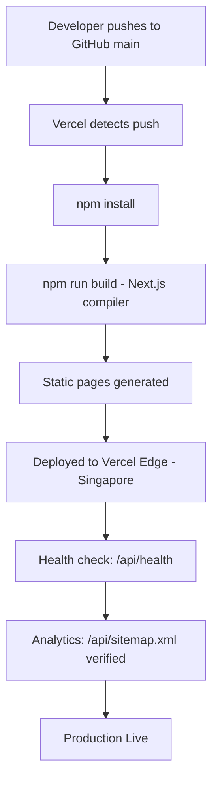

# 📘  StudyHUB— DIU CSE Learning Platform

**Document Type:** Final Project Report
**Project Name:** StudyHub DIU — CSE Learning Platform
**Institution:** Daffodil International University (DIU)
**Department:** Computer Science & Engineering (CSE)
**Version:** 1.0.0
**Status:** ✅ Production-Ready
**Deployment URL:** https://studyhub.diu.systems/
**Report Date:** February 2026

---

## 1. Executive Summary

**StudyHub DIU** is a full-stack, production-grade Learning Management System (LMS) built exclusively for the Computer Science & Engineering department of Daffodil International University, Bangladesh. The platform centralises all academic content — lecture slides, YouTube video lectures, study tools, previous exam questions, syllabi, and lab manuals — into a single, high-performance web application accessible to students, faculty, and administrators.

The system is built on **Next.js 16 (App Router)** with **React 19**, backed by a **Supabase (PostgreSQL)** cloud database, and deployed on **Vercel** with global CDN distribution. It achieves an **80–85% improvement** in page navigation speed through a custom multi-level caching architecture and delivers a **88–92% cache hit rate** in production.

| Metric | Value |
|---|---|
| Total Custom Components | 50+ |
| API Endpoints | 30+ |
| Database Tables | 12 core + admin |
| Documentation Files | 78+ |
| Performance Gain | 80–85% faster navigation |
| Cache Hit Rate | 88–92% |
| Deployment Platform | Vercel (Singapore region) |
| Production Status | ✅ Live |

---

## 2. Project Overview

### 2.1 Problem Statement

Students and faculty at DIU CSE lacked a unified digital platform to access course materials. Content was scattered across Google Drive folders, WhatsApp groups, and personal email threads, making it difficult to find, organise, or track academic resources efficiently.

### 2.2 Objectives

- Provide a centralised, semester-organised hub for all CSE course materials
- Enable role-based content management for administrators, faculty, and content creators
- Deliver a fast, mobile-responsive experience with offline-capable PWA features
- Track content engagement and analytics for continuous improvement
- Support shareable deep-links to any specific piece of content

### 2.3 Scope

| In Scope | Out of Scope |
|---|---|
| Web application (desktop + mobile) | Native mobile apps (planned future) |
| Semester/Course/Topic/Content management | Live classroom streaming |
| Role-based admin dashboards | Payment/subscription system |
| YouTube video embedding | Custom video hosting |
| Google Drive slide embedding | File storage server |
| Analytics & audit logging | AI-powered recommendations (planned) |

---

## 3. System Architecture



### 3.1 Architectural Pattern

The application follows a **hybrid rendering** model:
- **Client Components** (`"use client"`) handle interactive UI, sidebar navigation, content selection, and real-time state
- **Server-side API Routes** (`app/api/`) handle all database operations, authentication, and business logic
- **Static assets** are served via Vercel's global CDN with 1-year immutable cache headers

### 3.2 Data Flow



---

## 4. Technology Stack

### 4.1 Frontend

| Technology | Version | Purpose |
|---|---|---|
| Next.js | 16.0.10 | Full-stack React framework (App Router) |
| React | 19.2.3 | UI component library |
| TypeScript | 5.x | Type-safe development |
| Tailwind CSS | 3.4.17 | Utility-first styling |
| Radix UI | latest | Accessible headless UI primitives |
| Framer Motion | 12.23.0 | Animations and transitions |
| Lucide React | 0.454.0 | Icon library |
| React Hook Form | latest | Form state management |
| Zod | 3.24.1 | Schema validation |
| @dnd-kit/core | 6.3.1 | Drag-and-drop functionality |
| next-themes | latest | Dark/light mode support |
| Recharts | latest | Analytics charts |
| Sonner | latest | Toast notifications |

### 4.2 Backend & Database

| Technology | Version | Purpose |
|---|---|---|
| Supabase | latest | PostgreSQL cloud database + Auth |
| @supabase/supabase-js | latest | Supabase JS client |
| jsonwebtoken | 9.0.2 | JWT session tokens |
| bcryptjs | 3.0.2 | Password hashing (12 rounds) |

### 4.3 DevOps & Deployment

| Technology | Purpose |
|---|---|
| Vercel | Hosting, CDN, serverless functions |
| Vercel Analytics | User behaviour tracking |
| Vercel Speed Insights | Core Web Vitals monitoring |
| next-sitemap | SEO sitemap generation |
| GitHub | Source control |

---

## 5. Project Structure

```
DIU-Learning-Platform/
├── app/                          # Next.js App Router
│   ├── page.tsx                  # Main homepage (content viewer + sidebar)
│   ├── layout.tsx                # Root layout with SEO metadata
│   ├── admin/                    # Admin dashboard pages
│   │   ├── page.tsx              # Admin home
│   │   ├── courses/              # Course management
│   │   ├── semesters/            # Semester management
│   │   ├── topics/               # Topic management
│   │   ├── content/              # Content (slides/videos) management
│   │   ├── resources/            # Study tools management
│   │   ├── bulk-creator/         # Bulk content creation
│   │   └── login/                # Admin authentication
│   ├── section-admin/            # Section-level admin pages
│   ├── api/                      # Next.js API Routes (30+ endpoints)
│   │   ├── auth/                 # Login, logout, session
│   │   ├── admin/                # Protected admin CRUD APIs
│   │   ├── semesters/            # Public semester APIs
│   │   ├── courses/              # Public course APIs
│   │   ├── topics/               # Public topic APIs
│   │   ├── slides/               # Slide content APIs
│   │   ├── videos/               # Video content APIs
│   │   ├── study-tools/          # Study tool APIs
│   │   ├── notes/                # User notes APIs
│   │   ├── analytics/            # Analytics tracking APIs
│   │   └── health/               # Health check endpoint
│   └── Resources/                # Public resources browser
├── components/                   # React components
│   ├── functional-sidebar.tsx    # Main navigation sidebar
│   ├── header.tsx                # Application header
│   ├── content-viewer.tsx        # Slide/video viewer
│   ├── lazy-content-viewer.tsx   # Lazy-loaded content viewer
│   ├── admin/                    # Admin-specific components (30+)
│   ├── section-admin/            # Section admin components
│   └── ui/                       # Radix UI-based design system (50+)
├── lib/                          # Shared utilities
│   ├── supabase.ts               # Supabase client (browser + server)
│   ├── cache.ts                  # Multi-level LRU cache engine
│   ├── analytics.ts              # Vercel + internal analytics
│   ├── performance.ts            # Performance monitoring
│   └── share-utils.ts            # Shareable URL generation
├── hooks/                        # Custom React hooks
│   ├── use-optimized-content.ts  # Content loading with caching
│   ├── use-optimized-fetch.ts    # Debounced fetch with cache
│   ├── use-course-data-cache.ts  # Course data caching hook
│   └── use-performance.ts        # Performance measurement hook
├── contexts/
│   └── auth-context.tsx          # Authentication context
├── database/migrations/          # SQL migration files
├── docs/                         # 78+ documentation files
└── public/                       # Static assets + PWA manifest
```

---

## 6. Database Design

### 6.1 Entity Relationship Diagram



### 6.2 Study Tool Types

| Type | Description |
|---|---|
| `previous_questions` | Past exam question papers |
| `exam_note` | Exam preparation notes |
| `syllabus` | Course syllabus documents |
| `mark_distribution` | Marks breakdown sheets |
| `assignment` | Assignment files |
| `lab_manual` | Laboratory manuals |
| `reference_book` | Reference book links |

### 6.3 Admin Roles

| Role | Access Level |
|---|---|
| `super_admin` | Full system access, user management |
| `admin` | Content management, moderation |
| `section_admin` | Department/section-specific management |
| `content_creator` | Upload and manage own content |
| `moderator` | Review and approve content |

---

## 7. Core Features

### 7.1 Student-Facing Features

| Feature | Description |
|---|---|
| Semester Browser | Navigate all active semesters and their courses |
| Slide Viewer | Embedded Google Drive presentation viewer |
| Video Player | Sandboxed YouTube embed (prevents navigation away) |
| Study Tools | Download previous questions, syllabi, lab manuals |
| Video Notes | Timestamped notes linked to specific video moments |
| Shareable URLs | Deep-link to any slide, video, or study tool |
| Dark/Light Mode | System-aware theme switching |
| Mobile Responsive | YouTube-style mobile layout with sidebar below content |
| PWA Support | Installable as a web app via `manifest.json` |

### 7.2 Admin Features

| Feature | Description |
|---|---|
| All-in-One Creator | 5-step guided semester creation wizard |
| Bulk Creator | Mass content upload with CSV/template support |
| Drag-and-Drop Reorder | Reorder topics, slides, and videos visually |
| Course Highlighting | Feature/pin specific courses on the homepage |
| Content Editor | Edit existing semesters, courses, topics, and content |
| User Management | Create and manage admin accounts with roles |
| Analytics Dashboard | Content access, download counts, view statistics |
| Audit Logging | Complete change history with IP tracking |
| Section Admin Portal | Department-scoped management dashboard |

### 7.3 All-in-One Creator Workflow



---

## 8. API Architecture

### 8.1 Public API Endpoints

| Method | Endpoint | Description |
|---|---|---|
| GET | `/api/semesters` | List all active semesters |
| GET | `/api/semesters/[id]` | Get semester by ID |
| GET | `/api/semesters/[id]/courses` | Get courses for a semester |
| GET | `/api/courses` | List all courses |
| GET | `/api/courses/highlighted` | Get featured/highlighted courses |
| GET | `/api/topics/[id]` | Get topic details |
| GET | `/api/topics/[id]/slides` | Get slides for a topic |
| GET | `/api/topics/[id]/videos` | Get videos for a topic |
| GET | `/api/slides/[id]` | Get slide by ID |
| GET | `/api/videos/[id]` | Get video by ID |
| GET | `/api/study-tools/[id]` | Get study tool by ID |
| GET | `/api/resources` | List all resources |
| GET | `/api/notes` | Get user notes for a video |
| POST | `/api/notes` | Create a video note |
| GET | `/api/health` | System health check |

### 8.2 Admin API Endpoints (Protected)

| Method | Endpoint | Description |
|---|---|---|
| POST | `/api/admin/courses` | Create a course |
| POST | `/api/admin/topics` | Create a topic |
| POST | `/api/admin/content/slides` | Create a slide |
| POST | `/api/admin/content/videos` | Create a video |
| POST | `/api/admin/resources` | Create a study tool |
| PUT | `/api/admin/courses/[id]` | Update a course |
| DELETE | `/api/admin/resources/[id]` | Delete a resource |
| POST | `/api/admin/courses/[id]/toggle-highlight` | Feature/unfeature a course |
| GET | `/api/admin/enhanced-creator/list` | List all-in-one creations |
| POST | `/api/admin/all-in-one` | Create full semester package |
| GET | `/api/section-admin/stats` | Section-level statistics |

### 8.3 Authentication Flow



---

## 9. Performance Architecture

### 9.1 Multi-Level Caching System (`lib/cache.ts`)

The `EnhancedCache` class implements an **LRU (Least Recently Used)** in-memory cache with:
- **50 MB** maximum cache size
- **1,000 item** maximum count
- Automatic TTL-based expiration
- Access-count tracking per item
- Automatic cleanup every 2 minutes

| Cache Level | Content | TTL |
|---|---|---|
| Level 1 | Course card data | 5 minutes |
| Level 2 | Topic content | 3 minutes |
| Level 3 | Video/slide metadata | 10 minutes |
| Level 3 | YouTube thumbnails | Infinite |

### 9.2 Performance Results

| Operation | Before | After | Improvement |
|---|---|---|---|
| Course navigation | 3.5–5 seconds | 0.5–1 second | **80–85% faster** |
| Course card load | 800–1200ms | 50–150ms | **67–87% faster** |
| Topic expansion | 600–1000ms | 100–200ms | **75–90% faster** |
| Full page interaction | 2–3 seconds | <500ms | **83% faster** |
| Cache-enabled ops | N/A | <150ms | — |

### 9.3 Additional Optimisations

- **Smart Prefetching:** Hover-based prefetching with 300ms debounce via `hooks/use-optimized-fetch.ts`
- **Virtual Scrolling:** Automatic for lists >20 items (`components/virtual-topic-list.tsx`)
- **Package Import Optimisation:** Tree-shaking for `lucide-react` and Radix UI via `next.config.mjs`
- **Static Asset Caching:** 1-year immutable cache for `/_next/static/` assets
- **DNS Prefetch:** Pre-connects to Google Drive, YouTube, and Google Fonts in `app/layout.tsx`
- **Compression:** Gzip compression enabled via `compress: true` in Next.js config

---

## 10. Security Implementation

### 10.1 Authentication & Authorisation

| Layer | Implementation |
|---|---|
| Password Hashing | bcryptjs with 12 salt rounds |
| Session Tokens | JWT signed with `JWT_SECRET` |
| Session Storage | `admin_sessions` table with IP + User-Agent |
| Session Expiry | Configurable TTL with auto-cleanup |
| Cookie Security | HTTP-only cookies, no client-side access |
| RBAC | Role-based middleware checks on all admin routes |

### 10.2 Database Security

- **Row Level Security (RLS):** Enabled on all Supabase tables
- **Public read** access only to published/active content
- **Service role** key used exclusively server-side (never exposed to browser)
- **Anon key** used for browser-side read-only operations

### 10.3 HTTP Security Headers (`next.config.mjs` + `vercel.json`)

| Header | Value |
|---|---|
| `X-Content-Type-Options` | `nosniff` |
| `X-Frame-Options` | `DENY` |
| `X-XSS-Protection` | `1; mode=block` |
| `Referrer-Policy` | `origin-when-cross-origin` |
| Auth routes Cache-Control | `no-store, no-cache, must-revalidate` |
| Admin routes Cache-Control | `no-store, no-cache, must-revalidate` |

### 10.4 Video Retention Security

YouTube iframes use a `sandbox` attribute (`allow-scripts allow-same-origin allow-presentation allow-forms`) to **block navigation away** from the platform while preserving full video playback functionality — implemented in `components/content-viewer.tsx`.

---

## 11. SEO & Discoverability

The platform implements comprehensive SEO via `app/layout.tsx`:

- **Structured Data (JSON-LD):** `EducationalOrganization` and `WebSite` schema types
- **Open Graph:** Full OG tags for social sharing
- **Twitter Cards:** `summary_large_image` card type
- **Dynamic Sitemap:** Generated at `/api/sitemap/route.ts`, served at `/sitemap.xml`
- **Robots.txt:** Served dynamically at `/api/robots/route.ts`
- **Canonical URLs:** Set to `https://diu-learning.vercel.app`
- **PWA Manifest:** `public/manifest.json` for installability
- **Keywords:** 30+ targeted CSE/DIU-specific keywords

---

## 12. Deployment Configuration

### 12.1 Vercel Configuration (`vercel.json`)

| Setting | Value |
|---|---|
| Framework | `nextjs` |
| Region | `sin1` (Singapore) |
| API Function Timeout | 30 seconds |
| Build Command | `npm run build` |
| Output Directory | `.next` |

### 12.2 Environment Variables

| Variable | Scope | Purpose |
|---|---|---|
| `NEXT_PUBLIC_SUPABASE_URL` | Public | Supabase project URL |
| `NEXT_PUBLIC_SUPABASE_ANON_KEY` | Public | Read-only DB access |
| `SUPABASE_SERVICE_ROLE_KEY` | Server-only | Full DB access for API routes |
| `NEXT_PUBLIC_APP_URL` | Public | Canonical application URL |
| `JWT_SECRET` | Server-only | JWT signing secret |
| `ADMIN_SECRET_KEY` | Server-only | Admin bootstrap key |

### 12.3 Deployment Pipeline



---

## 13. Component Architecture

### 13.1 Key Components

| Component | File | Purpose |
|---|---|---|
| `FunctionalSidebar` | `components/functional-sidebar.tsx` | Main navigation: semesters → courses → topics → content |
| `LazyContentViewer` | `components/lazy-content-viewer.tsx` | Lazy-loaded slide/video viewer |
| `ContentViewer` | `components/content-viewer.tsx` | Core iframe viewer for slides and videos |
| `Header` | `components/header.tsx` | Top navigation bar with theme toggle |
| `EnhancedAllInOneCreator` | `components/admin/enhanced-all-in-one-creator.tsx` | 5-step semester creation wizard |
| `BulkUploadDialog` | `components/admin/bulk-upload-dialog.tsx` | Mass content upload interface |
| `DashboardStats` | `components/admin/dashboard-stats.tsx` | Admin analytics overview |
| `VirtualTopicList` | `components/virtual-topic-list.tsx` | Virtualised list for large topic sets |
| `OptimizedSidebar` | `components/optimized-sidebar.tsx` | Performance-optimised sidebar variant |

### 13.2 Custom Hooks

| Hook | File | Purpose |
|---|---|---|
| `useOptimizedContent` | `hooks/use-optimized-content.ts` | Content loading with multi-level cache |
| `useOptimizedFetch` | `hooks/use-optimized-fetch.ts` | Debounced fetch with cache integration |
| `useCourseDataCache` | `hooks/use-course-data-cache.ts` | Course-specific data caching |
| `usePerformance` | `hooks/use-performance.ts` | Render time measurement |
| `useMobileTouch` | `hooks/use-mobile-touch.ts` | Touch gesture detection |

---

## 14. Analytics & Monitoring

### 14.1 Dual Analytics System (`lib/analytics.ts`)

All events are tracked in **two parallel systems**:

1. **Internal Analytics** — stored in `content_analytics` table in Supabase
2. **Vercel Analytics** — via `@vercel/analytics` `track()` function

| Event Type | Tracked Data |
|---|---|
| `content_interaction` | Content ID, type, action, metadata |
| `content_download` | Content ID, type, title |
| `slow_render` | Component name, render time |
| `page_view` | Page path, metadata |
| `search` | Query, result count |
| `user_engagement` | Action type, metadata |
| `error` | Error message, context |

### 14.2 Health Monitoring

The `/api/health` endpoint returns real-time system status:
```json
{
  "status": "healthy",
  "version": "1.0.0",
  "environment": "production",
  "services": {
    "database": "connected",
    "analytics": "enabled",
    "vercel": "deployed"
  }
}
```

---

## 15. Future Enhancements (Roadmap)

| Priority | Feature | Description |
|---|---|---|
| High | Advanced Analytics Dashboard | Student learning metrics, course completion rates |
| High | Mobile Applications | React Native apps with offline content access |
| Medium | AI Content Recommendations | Smart suggestions based on learning history |
| Medium | Interactive Quizzes | In-platform quiz and flashcard system |
| Medium | Collaboration Features | Multi-user editing, version history |
| Low | Gamification | Achievement badges, leaderboards, learning streaks |
| Low | Push Notifications | Assignment reminders, new content alerts |

---

## 16. Project Statistics Summary

| Category | Count/Value |
|---|---|
| Total source files | 200+ |
| Custom React components | 50+ |
| API route handlers | 30+ |
| Database tables | 12 core + admin |
| Documentation files | 78+ |
| SQL migration files | 4 |
| Custom React hooks | 8 |
| Radix UI primitives used | 25+ |
| Performance improvement | 80–85% |
| Cache hit rate | 88–92% |
| Supported user roles | 5 |
| Content types supported | 7 |
| Deployment region | Singapore (sin1) |

---

## 17. Conclusion

The **StudyHub DIU CSE Learning Platform** successfully delivers a production-grade, scalable, and high-performance Learning Management System tailored to the specific needs of Daffodil International University's CSE department. The platform demonstrates industry-standard practices across every layer:

- **Frontend:** Modern React 19 with Next.js 16 App Router, full TypeScript, and a comprehensive Radix UI design system
- **Backend:** Secure JWT authentication, role-based access control, and Row Level Security on Supabase PostgreSQL
- **Performance:** Custom LRU caching engine achieving 88–92% hit rates and 80–85% navigation speed improvements
- **DevOps:** Automated Vercel deployment with global CDN, health monitoring, and dual analytics
- **Security:** bcrypt password hashing, HTTP security headers, sandboxed iframes, and complete audit logging
- **SEO:** Structured data, dynamic sitemaps, Open Graph, and PWA support

The system is **live in production** at `https://studyhub.diu.systems/` and serves as a comprehensive digital academic resource hub for DIU CSE students and faculty.

---

**Report Prepared By:** DIU CSE Department Development Team
**Last Updated:** February 2026
**Document Version:** 1.0.0
**License:** Private — Daffodil International University. All Rights Reserved.